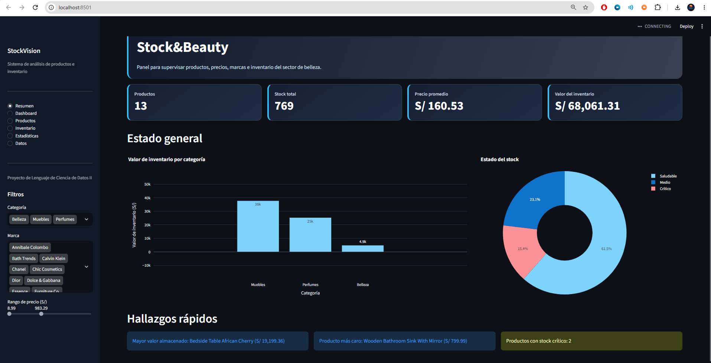

Stock & Beauty Dashboard

Dashboard interactivo desarrollado con Python y Streamlit para analizar productos, precios, marcas y niveles de inventario.

Funcionalidades
-Indicadores generales de productos e inventario.
-Filtrar por categoría, marca y rango de precio.
-Gráficos interactivos.
-Búsqueda de productos.
-Identificar productos con stock crítico.
-Descarga de datos en formato CSV.

Tecnologías utilizadas:
-Python
-Streamlit
-Pandas
-Plotly

Ejecución local
Descargar el repositorio.

Ejecutar la aplicación:
Haz doble clic en el archivo `EJECUTAR.bat`.

Este archivo instalará las dependencias necesarias e iniciará automáticamente la aplicación en el navegador.

En el navegador se abrira:
http://localhost:8501
